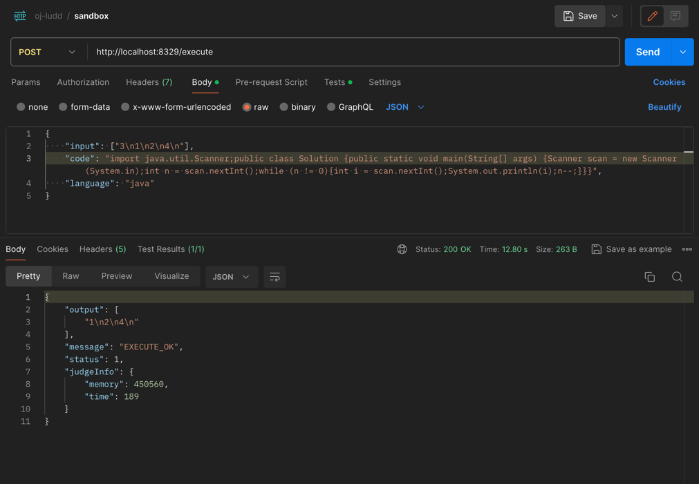
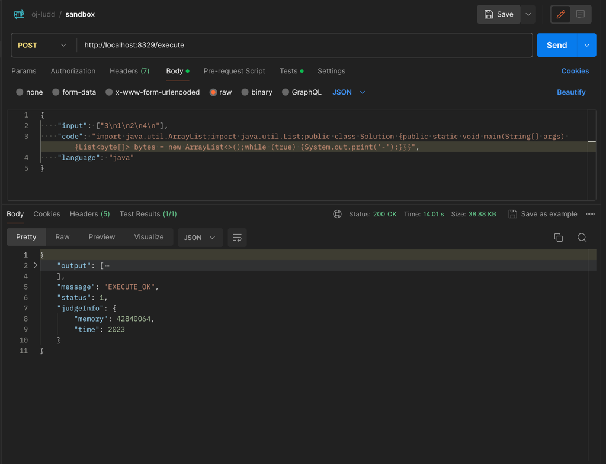
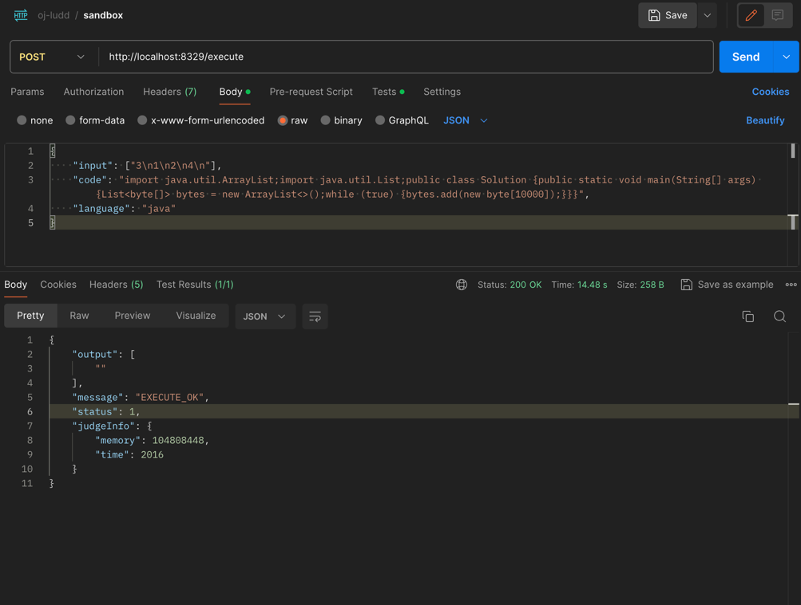

# 项目介绍

&emsp;使用Java + Docker技术实现的一个可用于在线判题系统的代码沙盒(sandbox)，可通过Http进行调用。

&emsp;Docker的容器化技术可以为我们隔离出一块非常安全的运行空间，通过Java程序，自动化将代码拷贝到容器中执行并获取响应结果。

&emsp;我们可以通过设置容器的最大内存、CPU核心数量等来限制代码运行的环境。

## 技术点

- 使用[docker-java](https://github.com/docker-java/docker-java)操作Docker，实现镜像拉取、容器创建、命令执行等；
- 使用简单工厂、模板方法等设计模式来扩展其他语言环境。

## 效果

#### 标准输入输出（输入数据可为空）

#### 代码错误

#### 超时恶意代码

#### 内存溢出恶意代码

#### 读取代码和删除代码

&emsp;容器内部的文件信息不会涉及到本机信息，删除容器内部文件不会影响到本机。

## 优化点

&emsp;因为代码沙盒需要通过一层Http请求来操作Docker，因此整个运行代码的过程所需时间会多一些，这在大量并发请求的时候，会影响整个沙盒判题的吞吐量。

